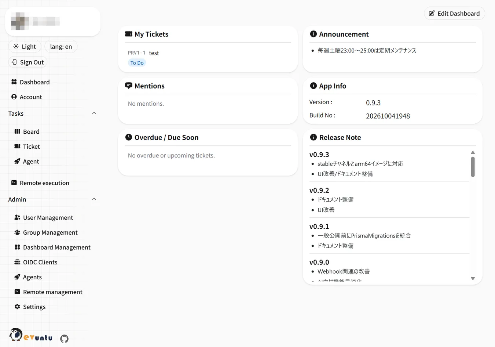
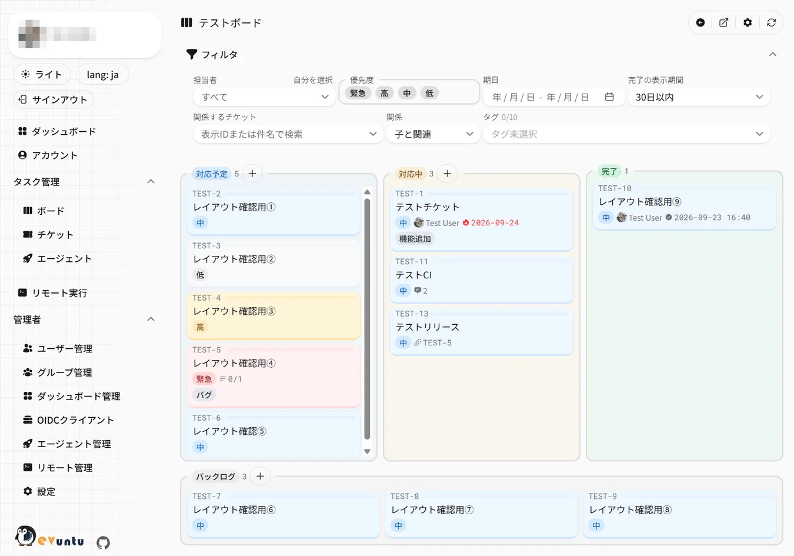

# Devuntu

[](https://github.com/playree/devuntu/actions/workflows/ci.yml)
[](LICENSE)
[](https://hub.docker.com/r/playree/devuntu)

English | [日本語](README.md)

Website: https://playree.github.io/devuntu/en/

Devuntu is a self-hosted development server setup tool centered around Kanban-style board/ticket management,
featuring calendar integration, email / Slack / web push notifications, MCP / AI agent integration and remote execution.

It started as a collection of features I wanted for solo and small-team development.
As AI-assisted development became common during its development, Devuntu has also been optimized for working with AI agents.
Devuntu itself is developed with AI, but not everything is left to AI: humans review and adjust the work,
and the AI agent features are designed around that same premise (a human check in the loop).

> [!NOTE]
> **The detailed documentation (`docs/`) is available in Japanese only.**
> Translation tools and AI have become accurate enough that we keep Japanese as
> the single source of truth, rather than maintaining versions in several languages.
> This README covers the overview and the steps to get started.
> For the details, please use a translation tool or an AI assistant with the linked documents.
>
> The application UI itself is available in both English and Japanese.

---



---

- [Features](#features)
- [Quick start](#quick-start)
  - [Requirements](#requirements)
  - [Services](#services)
  - [1. Place compose.yaml](#1-place-composeyaml)
  - [2. Generate the configuration files](#2-generate-the-configuration-files)
  - [3. Start](#3-start)
  - [4. Create the first administrator](#4-create-the-first-administrator)
  - [5. Sign in](#5-sign-in)
  - [Updating](#updating)
- [Integrations](#integrations)
- [Operations](#operations)
- [Documentation](#documentation)
- [Contributing](#contributing)
- [License](#license)

## Features

- Kanban boards and tickets (boards, tags, assignees, priorities, due dates, comments, mentions)
  - Parent/child and related tickets, acceptance criteria, per-board ticket templates and change history
  - Filter the board and the ticket list down to the children or related tickets of a given ticket
- Google Calendar integration, and sharing your free/busy time through a public URL that needs no sign-in
- Email / Slack DM / web push notifications for mentions, assignee changes and AI agent run results,
  and Slack channel notifications per team board (tickets created / completed, assignee changes, agent run results)
- An MCP server, so AI agents can work on tickets with your own permissions
- AI agents can be registered as assignees and process their assigned tickets automatically
  (currently `Claude` and `Codex` are supported)
  - Agents can split a large ticket into child tickets; once you approve the proposal, they work through the children in order
  - Per-board AI context (target repository, conventions, terms) delivered to MCP clients and agents as `boardContext`
- Link GitHub / GitLab (including self-hosted) branches, pull requests and commits to tickets,
  showing the PR status and CI results. Tickets can be completed automatically on merge,
  and CI failures or PR/MR review comments can send the ticket back to the agent automatically
- Run predefined jobs on remote servers and follow the output in real time
- Passkey authentication and Google sign-in
- Can act as an OAuth provider
- English / Japanese UI



## Quick start

Devuntu is distributed as a Docker image and runs with Docker Compose.
The full guide (in Japanese) is [docs/installation.md](docs/installation.md).

### Requirements

- A host running Docker **Engine 25.0+** and Docker **Compose v2.24+**
- **Memory: 2 GB minimum, 4 GB recommended** (when pulling the published image)
- The URL users will open Devuntu with. It is set as `BETTER_AUTH_URL` and **must exactly match the
  origin actually served**, otherwise sign-in requests are rejected by the origin check
- For HTTPS: DNS and a reverse proxy (or load balancer) that terminates TLS and forwards to port 3000.
  `compose.yaml` only exposes plain HTTP on port 3000. Allow request bodies of **6 MB or more** for image uploads
  (nginx `client_max_body_size` defaults to 1 MB)
- **A way to send email** (SendGrid / sendmail / SMTP). In the minimal setup, email OTP is the only way to sign in.
  For a trial, `MAIL_SEND=debug` prints the OTP to the server log instead

### Services

| Service   | Role                         |
| --------- | ---------------------------- |
| `devuntu` | The application (Next.js)    |
| `db`      | Database (PostgreSQL)        |
| `s3`      | File storage (SeaweedFS, S3) |

`tools` is a one-off service for generating configuration, backup/restore and maintenance mode.
It does not start with `docker compose up`.

### 1. Place compose.yaml

Put [`compose.yaml`](compose.yaml) from this repository in any writable directory (e.g. `/opt/devuntu`).
**This is the only file you need**; cloning the repository is not required.

### 2. Generate the configuration files

In that directory, run:

```sh
docker compose run --rm tools setup-env
```

It asks for the settings interactively and generates `.env.docker` (application),
`.env.db` (PostgreSQL) and `seaweedfs-s3.json` (object storage credentials).
On the first run it asks for the language first; choose English to get English prompts
and an English default UI (`DEFAULT_LOCALE`).
Secrets such as `BETTER_AUTH_SECRET` and the database password are generated for you.
You can run it again later to change settings; the current values are offered as defaults.

> [!WARNING]
> The database password cannot be changed after the first start. PostgreSQL keeps the password
> it was initialized with, even if you edit `.env.db` later.

All environment variables are listed in [docs/environment-variables.md](docs/environment-variables.md).

### 3. Start

```sh
docker compose up -d --wait
```

Database migrations run automatically on startup. Check that it is up:

```sh
docker compose ps
curl -s http://localhost:3000/api/health
# => {"status":"ok","timestamp":"..."}
```

### 4. Create the first administrator

Open `<BETTER_AUTH_URL>/start` in a browser and register the first administrator (name and email address).
This page is only available while there are no users, so **do this right after starting**.
Further users are added by an administrator at `/admin/users`.

### 5. Sign in

Sign in at `<BETTER_AUTH_URL>/auth/signin` with the email OTP.
If no email arrives, review the `MAIL_SEND` settings. With `MAIL_SEND=debug`, the OTP is written to
`docker compose logs devuntu`.

### Updating

```sh
docker compose pull
docker compose up -d
```

Migrations are applied automatically. **Take a backup before updating** (see [Operations](#operations)).

## Integrations

All of them are optional. Each is enabled once its requirements are met (for environment variables, restart `devuntu`);
Google and Slack additionally need to be enabled by an administrator at `/admin/settings`.

| Integration      | Requires                                                                    | Enables                                                                                         |
| ---------------- | --------------------------------------------------------------------------- | ----------------------------------------------------------------------------------------------- |
| Email            | `MAIL_SEND` / `MAIL_FROM`                                                   | Email OTP sign-in and email notifications                                                       |
| Google           | `GOOGLE_CLIENT_ID` / `GOOGLE_CLIENT_SECRET`                                 | Google sign-in and the calendar                                                                 |
| Slack            | The `SLACK_*` variables                                                     | Slack DM notifications and ticket URL unfurling                                                 |
| Web push         | `VAPID_PUBLIC_KEY` / `VAPID_PRIVATE_KEY`                                    | Push notifications to browsers and phones                                                       |
| GitHub           | Nothing (a secret is issued per repository in the board settings)           | PR status and CI results, auto-complete on merge, send back to the agent on CI failure / review |
| GitLab           | `GITLAB_URLS`                                                               | MR status and CI results, auto-complete on merge, send back to the agent on CI failure / review |
| MCP              | `OIDC_DCR_ENABLED=true`                                                     | Connections from MCP clients to `<BETTER_AUTH_URL>/api/mcp`                                     |
| AI agents        | Creating an agent and issuing a token at `/admin/agents`                    | Automatic ticket processing by agents                                                           |
| Remote execution | `COMMAND_EXEC_ENABLED=true`, definition files, an SSH key and `known_hosts` | Running predefined jobs on remote servers from the UI                                           |

Details (in Japanese): [installation](docs/installation.md#外部サービス連携任意),
[notifications](docs/notifications.md), [MCP server](docs/mcp-server.md),
[AI agents](docs/agent-runner.md), [remote execution](docs/command-exec.md).

## Operations

The database and uploaded images are stored separately, so **always back them up as a pair**:

```sh
docker compose run --rm tools full-backup   # add --maintenance to block access while backing up
docker compose run --rm tools full-restore
docker compose run --rm tools maintenance on|off
```

See [docs/operations.md](docs/operations.md) for the procedures and scheduled runs.

## Documentation

The following documents are in Japanese.

| Document                                                           | Contents                                                                |
| ------------------------------------------------------------------ | ----------------------------------------------------------------------- |
| [docs/user-guide.md](docs/user-guide.md)                           | How to use each screen                                                  |
| [docs/installation.md](docs/installation.md)                       | Self-hosting setup                                                      |
| [docs/operations.md](docs/operations.md)                           | Backup / restore and maintenance                                        |
| [docs/environment-variables.md](docs/environment-variables.md)     | Environment variables                                                   |
| [docs/notifications.md](docs/notifications.md)                     | Notification settings and Slack App setup                               |
| [docs/mcp-server.md](docs/mcp-server.md)                           | MCP server: registration, tools and tokens                              |
| [docs/agent-runner.md](docs/agent-runner.md)                       | Running AI agents automatically: setup and operation (Devuntu Agent)    |
| [docs/command-exec.md](docs/command-exec.md)                       | Remote execution (definitions, SSH, permissions)                        |
| [docs/development.md](docs/development.md)                         | Development environment, builds and package management (for developers) |
| [docs/screens.md](docs/screens.md)                                 | Screens, APIs and access control (for developers)                       |
| [docs/operations-internals.md](docs/operations-internals.md)       | How backup and maintenance work (for developers)                        |
| [docs/notifications-internals.md](docs/notifications-internals.md) | How notifications work: queue, triggers, channels (for developers)      |
| [docs/mcp-server-internals.md](docs/mcp-server-internals.md)       | MCP server internals: authentication and input rules (for developers)   |
| [docs/agent-runner-internals.md](docs/agent-runner-internals.md)   | How the AI agent automation works (for developers)                      |
| [docs/command-exec-internals.md](docs/command-exec-internals.md)   | Remote execution internals (for developers)                             |

## Contributing

Issues and pull requests are welcome, in English as well. See [CONTRIBUTING.md](CONTRIBUTING.md).
Translations into other UI languages are welcome too; the steps are in [Adding a language](CONTRIBUTING.md#言語の追加).
Please do not report vulnerabilities in public issues; follow [SECURITY.md](SECURITY.md) instead.

## License

[MIT License](LICENSE)

Copyright (c) 2026 Devuntu Contributors
