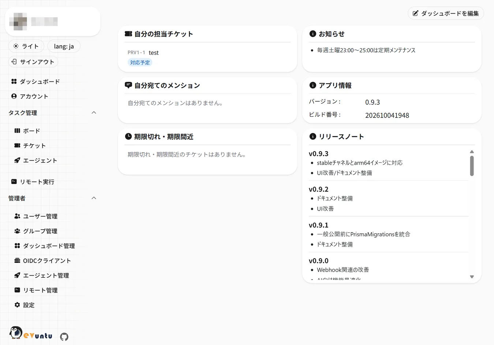
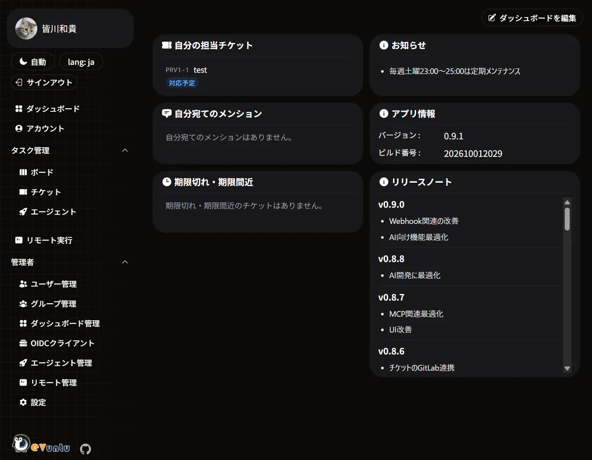
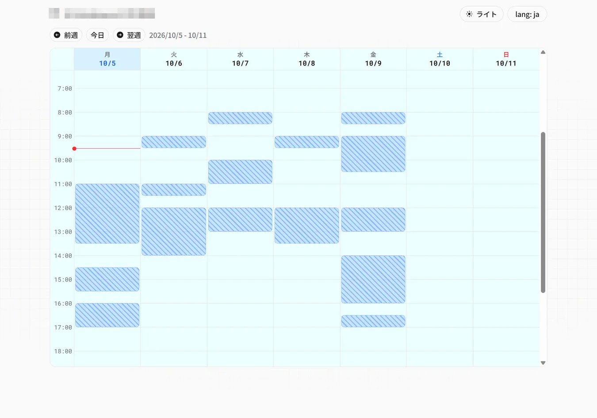

# Devuntu

[](https://github.com/playree/devuntu/actions/workflows/ci.yml)
[](LICENSE)
[](https://hub.docker.com/r/playree/devuntu)

[English](README.en.md) | 日本語

Website: https://playree.github.io/devuntu/

> [!NOTE]
> **English README: [README.en.md](README.en.md)** (overview and quick start).
> The detailed documentation is available in Japanese only.

Devuntu は、かんばん形式のボード/チケット管理を中心に、
カレンダー連携、メール/Slack/Webプッシュ通知、MCP/AIエージェント連携、リモート実行などを備えた
セルフホスト型のプロジェクト管理ツールです。

- シンプルなチケット＆かんばんボードが欲しい
- Claude Codeを利用してプラン作成→実装と進めた際に、プランや実装結果を残しておきたい
- 就寝中の時間を有効活用したい（就寝中にClaude Codeでチケットを処理させる）
- 各種通知はSlackに欲しい
- GitHub / GitLab(セルフホスト)と連携させたい
- 自分の空き時間を共有したい
- 定型処理をツール化したい

など、個人・少数チーム開発をするうえで、自分が開発する上で欲しいと思った機能を形にしたものになります。  
なので、連携機能(サービス)も自分が普段使っているものがメインとなっています。(Claude / GitHub / GitLab / Slack / Googleアカウント)  
開発中にAI開発が普及してきたこともあり、AI開発にも最適化しています。

Devuntuの開発にもAI開発を採用していますが、全てをAI任せではなく、人による確認と調整を行っています。  
DevuntuのAIエージェント向けの機能も、この(人による確認を挟む)前提で最適化しています。

それとDevuntuの基礎(基本構成や初期画面やAPIなど)は、まず人の手で作成しています。  
基礎やベースとなる画面などを用意することにより、AIはそれを真似てくれるので、かなり開発が安定すると思います。

---



<p>
  
  
</p>

---

- [Devuntu](#devuntu)
  - [できること](#できること)
  - [設計・開発方針](#設計開発方針)
  - [ドキュメント](#ドキュメント)
- [導入者向け](#導入者向け)
  - [構成](#構成)
  - [導入の流れ](#導入の流れ)
  - [外部サービス連携](#外部サービス連携)
  - [運用](#運用)
    - [メンテナンスモードでフルバックアップを取得してから、Devuntuを新しい版にアップグレードする場合](#メンテナンスモードでフルバックアップを取得してからdevuntuを新しい版にアップグレードする場合)
  - [環境変数](#環境変数)
- [利用者向け](#利用者向け)
  - [シンプルなチケット＆かんばんボード](#シンプルなチケットかんばんボード)
  - [カレンダーと空き時間の共有](#カレンダーと空き時間の共有)
  - [表示言語](#表示言語)
  - [通知](#通知)
  - [AIとの連携](#aiとの連携)
    - [MCPサーバー](#mcpサーバー)
    - [AIエージェント](#aiエージェント)
    - [AI向けの共通インプット定義](#ai向けの共通インプット定義)
    - [Devuntu Agentのセットアップ](#devuntu-agentのセットアップ)
    - [承認](#承認)
  - [リモート実行](#リモート実行)
- [開発者向け](#開発者向け)
  - [パッケージ構成](#パッケージ構成)
  - [開発環境](#開発環境)
  - [画面とアクセス制御](#画面とアクセス制御)
  - [テスト・Lint](#テストlint)
  - [コードレビュー](#コードレビュー)
- [ライセンス](#ライセンス)

---

## できること

- かんばんとチケット管理(ボード、タグ、担当者、優先度、期日、コメント、メンション)
  - 親子・関連チケット、受け入れ条件、ボードごとのチケットテンプレート、変更履歴
  - かんばん・一覧で、指定したチケットの子・関連チケットに絞り込める
- Googleカレンダー連携と、認証不要な公開URLでの空き時間共有
- メンションや担当者変更のメール / Slack DM / Webプッシュ通知
- MCPサーバーとして、AIエージェントから自分の権限でチケットを操作できる
- AIエージェントを担当者として登録でき、担当チケットをAIエージェントが自動的に処理する仕組みを構築できる(現状は`Claude`と`Codex`に対応)
  - 大きなチケットはエージェントが子チケットの起票案を出し、承認すると子を順番どおりに自動で処理する(タスク分割)
  - 対象リポジトリや規約など、ボード共通の前提を「AI向けコンテキスト」として MCP クライアント・エージェントへ届ける
- GitHub / GitLab(セルフホスト版を含む)のブランチ / プルリクエスト / コミットをチケットに紐付け、PR の状態と CI の結果を表示。  
  マージでチケットを自動で完了にでき、CI の失敗や PR / MR のレビュー指摘でエージェントへ自動で差し戻せる
- 定義済みの処理をリモートのサーバーで実行し、出力をリアルタイムで確認できる
- パスキー認証、Googleログイン
- OAuthプロバイダとして利用できる
- 日本語 / 英語の表示切り替え

## 設計・開発方針

- **シンプルな機能やUI**  
  まずは自分が使いやすいと思うものを実現する
- **最新のライブラリやフレームワークを利用**  
  開発のプロトタイプとしての側面を持つ
- **AI開発に最適化**  
  後付け的なMCPとかでは無く、最初からAI開発を前提とした機能設計
- **アップデートの継続**  
  出来る限りアップデートを続けていきます

## ドキュメント

読む人に合わせて分けています。入口は [docs/README.md](docs/README.md) です。

| 読む人                                       | まず読むもの                                     | 一覧                               |
| -------------------------------------------- | ------------------------------------------------ | ---------------------------------- |
| 使う人(チケットを書く・見る・AIに任せる)     | [はじめに](docs/guide/getting-started.md)        | [利用者向け](docs/guide/README.md) |
| 立てる人・管理する人(導入・運用・管理者)     | [導入(セルフホスト)](docs/admin/installation.md) | [運用者向け](docs/admin/README.md) |
| 作る人(Devuntu 自体の開発・コントリビュート) | [開発](docs/dev/development.md)                  | [開発者向け](docs/dev/README.md)   |

# 導入者向け

Dockerイメージ(linux/amd64 / linux/arm64。arm64 は 0.9.3 以降)を提供しており、`compose.yaml`で簡単に構築できるようにしています。

## 構成

Docker Compose で3つのサービスを起動します(`compose.yaml`)。

| サービス  | 役割                          |
| --------- | ----------------------------- |
| `devuntu` | アプリ本体(Next.js)           |
| `db`      | データベース(PostgreSQL)      |
| `s3`      | ファイルストレージ(SeaweedFS) |

ほかに、設定ファイルの生成・バックアップ/リストア・メンテナンスモードの切り替えに使う使い捨ての `tools` サービスがあります
(`docker compose run --rm tools <サブコマンド>` で実行し、`docker compose up` では起動しません)。

## 導入の流れ

1. [`compose.yaml`](https://github.com/playree/devuntu/blob/stable/compose.yaml) をホストへ配置する(必要なファイルはこれだけ)
2. `docker compose run --rm tools setup-env` で設定ファイル(`.env.docker` / `.env.db` / `seaweedfs-s3.json`)を対話生成する
3. `docker compose up -d --wait` で起動する(DBマイグレーションは起動時に自動実行)
4. `<BETTER_AUTH_URL>/start` を開いて最初の管理者を登録する
5. 必要に応じて Google / Slack / MCP / AIエージェントの連携を設定する

手順の詳細と注意点は [docs/admin/installation.md](docs/admin/installation.md)、導入後にやることは [docs/admin/README.md](docs/admin/README.md#導入後にやること) を参照。

## 外部サービス連携

いずれも任意です。「前提」の設定を済ませると有効になり、Google と Slack はさらに管理者が `/admin/settings` で有効化します。

| 連携           | 前提                                                             | 有効にすると                                                           |
| -------------- | ---------------------------------------------------------------- | ---------------------------------------------------------------------- |
| メール         | `MAIL_SEND` / `MAIL_FROM`                                        | メールOTPでのサインインとメール通知                                    |
| Google         | `GOOGLE_CLIENT_ID` / `GOOGLE_CLIENT_SECRET`                      | Googleサインインとカレンダー機能                                       |
| Slack          | `SLACK_*` 一式                                                   | Slack DM 通知とチケットURLの展開                                       |
| Webプッシュ    | `VAPID_PUBLIC_KEY` / `VAPID_PRIVATE_KEY`                         | ブラウザ / スマートフォンへのプッシュ通知                              |
| GitHub         | 不要(ボード設定で対応付けごとにシークレットを発行)               | PR の状態・CI の反映、マージでの自動完了、エージェントへの自動差し戻し |
| GitLab         | `GITLAB_URLS`                                                    | MR の状態・CI の反映、マージでの自動完了、エージェントへの自動差し戻し |
| MCP            | 不要(ブラウザでの認可も使うなら `OIDC_DCR_ENABLED=true`)         | MCPクライアントからの接続                                              |
| AIエージェント | `/admin/agents` でのエージェント作成とトークン発行               | エージェントによるチケットの自動処理                                   |
| リモート実行   | `COMMAND_EXEC_ENABLED=true` と定義ファイル / SSH鍵 / known_hosts | 画面からリモートサーバーでの定義済み処理の実行                         |

## 運用

DB とアップロード画像は別々バックアップ可能ですが、バックアップはセットでまとめて取得することをお勧めします。
`docker compose run --rm tools full-backup` で両方を1つのディレクトリへまとめて取得でき、
`full-restore` で対のまま復元できます(リポジトリを clone せずに実行できます)。
`full-backup --maintenance` にすると、取得の間だけメンテナンスモードにして DB と画像のずれを無くせます
(開始前から ON の場合は、取得後も ON のままにします)。

リストア中は**メンテナンスモード**で全アクセスを遮断できます
(`docker compose run --rm tools maintenance on|off`)。アプリを止めずに、利用者へは案内画面を返します。
手順・定期実行は [docs/admin/operations.md](docs/admin/operations.md) を参照。

アップデートは `docker compose pull && docker compose up -d`。マイグレーションは起動時に自動適用されます。
`compose.yaml` が参照するのは、リリース後に問題が無いことを確認した版(`stable`)です。
イメージのタグの使い分けは [docs/admin/installation.md](docs/admin/installation.md#イメージのタグ) を参照。

### メンテナンスモードでフルバックアップを取得してから、Devuntuを新しい版にアップグレードする場合

バックアップの取得からアップグレードの完了まで、メンテナンスモードで利用者を止めておきます
(取得後の書き込みがバックアップに入らず、アップグレードに失敗して戻したときに失われるため)。

```sh
docker compose pull                                       # 先に新しいイメージを取得(利用者は止めない)
docker compose run --rm tools maintenance on              # 利用者を止める
docker compose run --rm tools full-backup --maintenance   # 接続が切れるのを待って取得(ON のまま)
docker compose up -d --wait                               # 新しいイメージで起動(マイグレーションも自動)
docker compose logs devuntu                               # 起動を確認してから解除する
docker compose run --rm tools maintenance off
```

## 環境変数

環境変数の一覧は [docs/admin/environment-variables.md](docs/admin/environment-variables.md) を参照。

# 利用者向け

初めての方は [はじめに](docs/guide/getting-started.md)、画面の使い方は [docs/guide/user-guide.md](docs/guide/user-guide.md) にまとめています。

## シンプルなチケット＆かんばんボード

タスクなどをチケット管理するメイン機能です。
必要な機能は盛り込みつつも、なるべくシンプルに、

- 1プロジェクト＝1ボード
- ステータスは、`対応予定`/`対応中`/`完了`/`バックログ`の4種類固定
- 優先度は、`緊急`/`高`/`中`/`低`の4種類固定
- 個人用にプライベートボードを用意
- タグ付け（タグでのフィルタ）
- チケットの関連付け、親子関係（関連チケットでのフィルタ）
- Markdownベースの[MDXEditor](https://mdxeditor.dev/)を採用

`機能追加`/`不具合`のような恒久的な分類はタグを利用し、`v1.0.0リリース`のような一時的な分類は`v1.0.0リリース`チケットを作成し、関連付けで管理する使い方をイメージしてます。  
分類としてはこれくらいで十分かなと。

あと、スプリントという概念は取り入れていません。  
期限を適切に設定し、期限でフィルタ出来れば十分かなと。


## カレンダーと空き時間の共有

Googleアカウントと連携すると、`/cal` で自分の予定を確認できます。
「空き時間の共有」を有効にすると**認証不要の公開URL**が発行され、予定の詳細を見せずに空き状況だけを共有できます。



## 表示言語

画面は日本語と英語に対応しています。サイドバーの `lang` から切り替えられ、ログイン中はアカウントに保存されます。
初回はブラウザの言語に合わせ、日本語・英語のどちらでもなければ環境変数 `DEFAULT_LOCALE`(未設定なら英語)で表示します。
ほかの言語の追加手順は [CONTRIBUTING.md](CONTRIBUTING.md#言語の追加) を参照。

## 通知

メンション・担当者の変更・AIエージェントの実行結果を、**メール** / **Slack DM** / **Webプッシュ**で通知します。
通知の ON/OFF はイベント種別 × チャネルごとに `/account` の「通知設定」から切り替えられます。

- **メール** — `MAIL_SEND` が設定されていれば使えます。利用者側の作業は不要です
- **Slack DM** — 管理者による連携の有効化と、利用者本人の Slack アカウント連携が必要です
- **Webプッシュ** — VAPID 鍵の設定が前提で、通知を受けたい端末ごとに `/account` から購読を登録します

チームボードでは、チケットの作成・完了・担当者の変更・エージェントの実行結果を Slack チャンネルへ流せます。
また Slack に貼られたチケットURLは、閲覧権限を確認した上でカード表示に展開されます。

Slack App の設定などは [docs/admin/notifications.md](docs/admin/notifications.md)、実装の詳細は [docs/dev/notifications-internals.md](docs/dev/notifications-internals.md) を参照。

## AIとの連携

DevuntuはMCPサーバーの単純な提供だけでなく、AI開発に適した形で提供します。

### MCPサーバー

最近では対応サービスも増えてきたMCPサーバー機能です。  
`/api/mcp` へ接続すると、自分の権限でチケットの検索・作成・更新ができます。  
コメントを、プラン(`type=plan`)や報告書(`type=report`)として投稿できるようになっており、対応内容を確認し易くなっています。

- チケットURLと共に「このチケットを対応して」と指示すれば、チケット内容を読み取り、プランの投稿から、対応後の報告までをチケットにまとめられます。
- もしくは、直接指示でプランを作成した状態で、「チケットを作成してから対応を進めて」と指示すれば、チケット作成も任せることもできます。
- チケットに受け入れ条件があれば、対応後に条件ごとの充足と根拠を自己申告として記録します(`report_acceptance_criteria`)。
- チケットの作成時にボードのチケットテンプレートを指定でき、ボードの「AI向けコンテキスト」はチケットやボードの取得時に `boardContext` として届きます。

つなぎ方と使い方は [docs/guide/ai.md](docs/guide/ai.md)、公開設定とトークンの運用は [docs/admin/mcp-server.md](docs/admin/mcp-server.md) を参照

### AIエージェント

AIエージェントを担当者にし、チケットの「エージェントモード」を選ぶと、設定したAIエージェントのCLI が自動起動して対応をおこないます。

- **エージェントモード：自動実行**  
  チケットの内容をAIエージェントが自動で処理します。  
  処理結果を報告書として投稿します。
- **エージェントモード：プラン先行**  
  チケットの内容からAIエージェントがまずはプランを投稿します。  
  ユーザーはプランを確認し、その後の指示(「進めて」や「修正して」など)をコメントで返信します。  
  返信内容でAIエージェントは対応を続行し、処理結果を報告書として投稿します。

このようにチケットの割り当てとコメントだけでAIエージェントに対応させることができます。

- **タスク分割**  
  大きなチケットでは、エージェントがプランとして子チケットの起票案を投稿します。
  承認すると子チケットが起票され、エージェントが順番どおりに処理します。
- **自動差し戻し**  
  ボード設定で有効にすると、紐付いた PR / MR の CI の失敗やレビュー指摘を受けて、報告済みのチケットをエージェントへ自動で差し戻します。

詳しい使い方は [docs/guide/ai.md](docs/guide/ai.md#エージェントにチケットを任せる) を参照

### AI向けの共通インプット定義

AI向けにインプットできる共通定義を2種類用意しています。

- **AI向けコンテキスト**  
  これはボード単位で持てる情報です。  
  MCP/エージェント両方でチケットを処理する際に読み込むので、両方に効きます。  
  基本的にボード単位のルールなどを記載します。
- **カスタム指示**  
  これはエージェント単位に持てる情報です。  
  特定のエージェントが処理をする際に読み込みます。  
  エージェント単位での共通ルールなどを記載します。

上記共通インプット定義と、プロジェクト(リポジトリ)配下の定義(`CLAUDE.md`/`AGENTS.md`など)、そしてチケット内容がチケット処理時のインプット内容となるので、これらを適切にご利用ください。

### Devuntu Agentのセットアップ

なるべく簡単にセットアップできるように整備しています。

1. エージェントが稼働するインスタンスを用意する  
   Ubuntuで独立したインスタンスを用意するのがおすすめ
2. 用意したインスタンスに`Claude or Codex`のCLIをインストール
3. DevuntuのMCPサーバーを登録
4. そして、`devuntu のエージェントをセットアップして`と指示するだけです。  
   対話式でセットアップすることができます。  
   セットアップの途中でエージェント用のトークンが要求されますので、管理者画面から発行してください。
5. あとは、必要に応じでエージェントの作業ディレクトリで開発できるように開発環境をセットアップしてください。  
   Git操作が必要ならGitの設定や、DBが必要ならDBのセットアップなど。

仕組みは至ってシンプルで、用意してあげたエージェント用の開発環境で、エージェントが定期的に自分担当のチケットをチェックし、対象チケットがあればその内容をヘッドレスモードで処理して、結果を報告するというだけです。

> [!TIP]
> エージェント側からDevuntuサーバーにポーリングする方式としている為、エージェント側にポート開放など特別な設定は不要です。  
> エージェント側からDevuntuサーバーへ通信できる環境であれば利用できます。

設置・運用は [docs/admin/agent-runner.md](docs/admin/agent-runner.md)、仕組みは [docs/dev/agent-runner-internals.md](docs/dev/agent-runner-internals.md) を参照

### 承認

自分が承認者になっているエージェントのチケットは `/agents` からまとめて確認・許可できます。  
同じ画面からエージェントの自動運用設定・ルール・今月の利用(コスト・トークン数)・実行履歴も操作できます。

## リモート実行

デプロイやバッチ実行など、サーバーのコマンド作業を画面から実行できるようにする機能です。  
ただし、リモートコンソールのような自由にコマンドを入力できるものではなく、  
サーバー上で管理するYAMLに定義したSSHの接続先と、コマンド(指定のシェルファイル)を実行するものとなります。  
コマンドへのパラメータは画面上から指定できるようになっています。  
出力は実行中もリアルタイムで流れ、履歴として残ります。

定義の書き方・SSHの準備・権限の考え方は [docs/admin/command-exec.md](docs/admin/command-exec.md) を参照。

# 開発者向け

積極的に最新技術を取り込んでいこうと思っています。

## パッケージ構成

- Node.js v24
- Next.js v16
- TypeScript v7(v6 と併存。詳細は[docs/dev/development.md](docs/dev/development.md#typescript-v7-と-v6-の併存)を参照)
- pnpm v12
- Prisma v7
- Better Auth v1.7
- Tailwind CSS v4
- HeroUI v3
- Zod v4
- next-safe-action v8

なるべく最新ライブラリを採用していきます。

## 開発環境

開発環境のセットアップ、ビルド、パッケージ管理、イメージ作成などの手順は
[docs/dev/development.md](docs/dev/development.md) を参照。

## 画面とアクセス制御

画面一覧とアクセス制御の実装、および API のアクセス制御は [docs/dev/screens.md](docs/dev/screens.md) を参照。
機能ごとの仕組みは [docs/dev/README.md](docs/dev/README.md) に一覧があります。

## テスト・Lint

```sh
pnpm test       # vitest
pnpm lint       # eslint
pnpm typecheck  # tsgo
pnpm build      # ビルド確認
```

ブランチ・コミット・Pull Request の出し方とコーディングルールは [CONTRIBUTING.md](CONTRIBUTING.md) を参照。  
脆弱性の報告は公開の Issue にせず、[SECURITY.md](SECURITY.md) の手順で非公開に行ってください。

## コードレビュー

PRに対しては[CodeRabbit](https://www.coderabbit.ai/)でのレビューを利用しています。

# ライセンス

[MIT License](LICENSE)

Copyright (c) 2026 Devuntu Contributors
