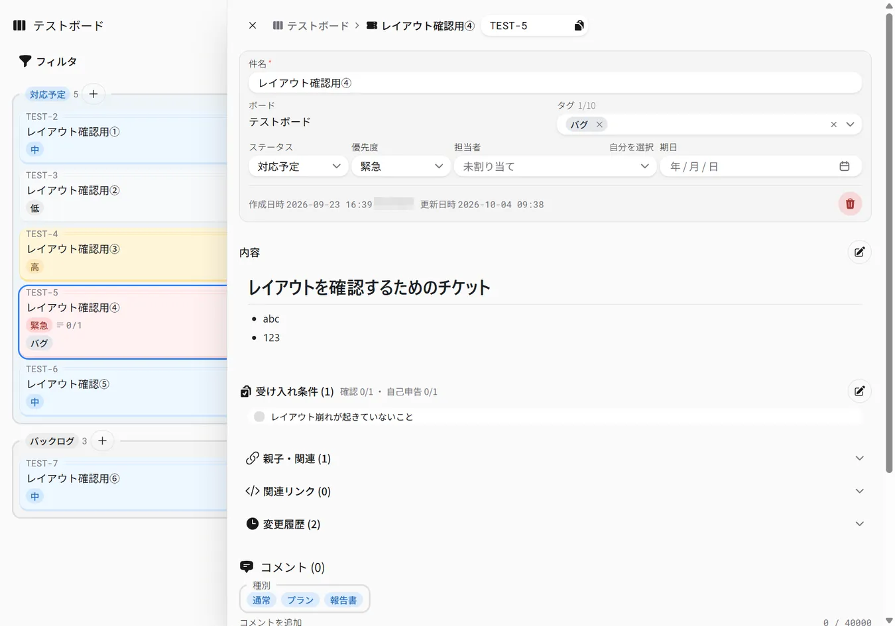
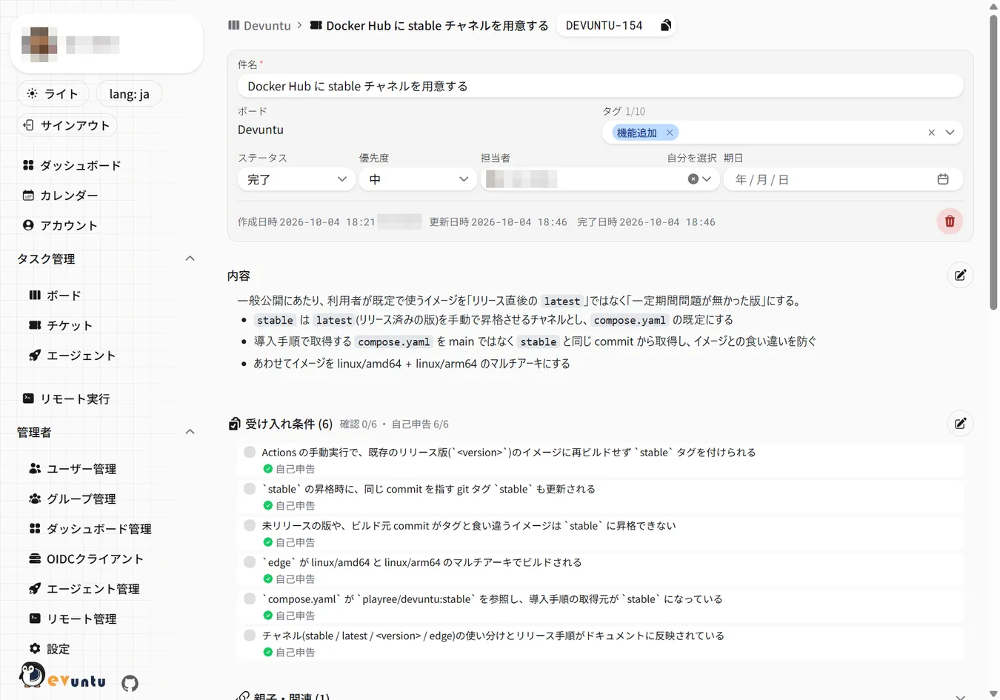
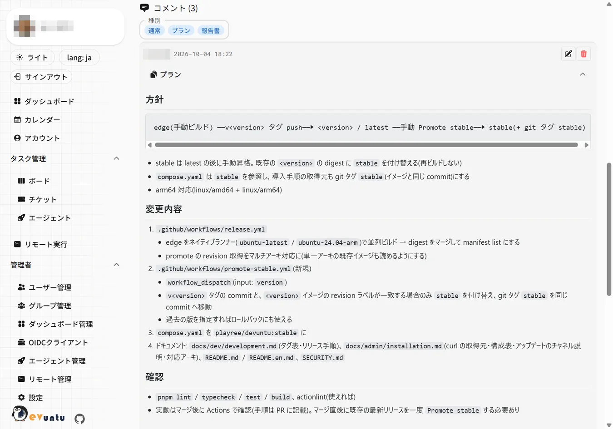
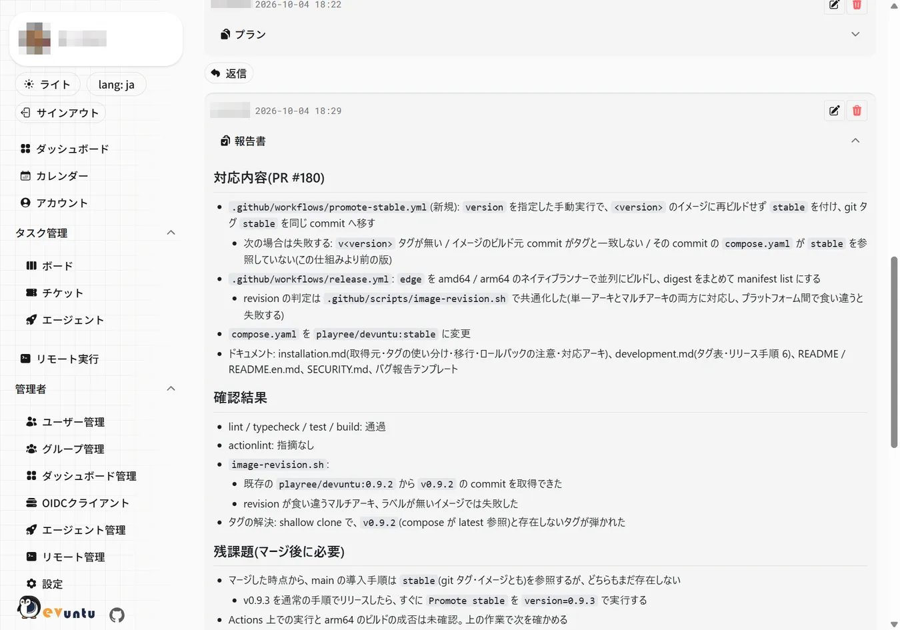
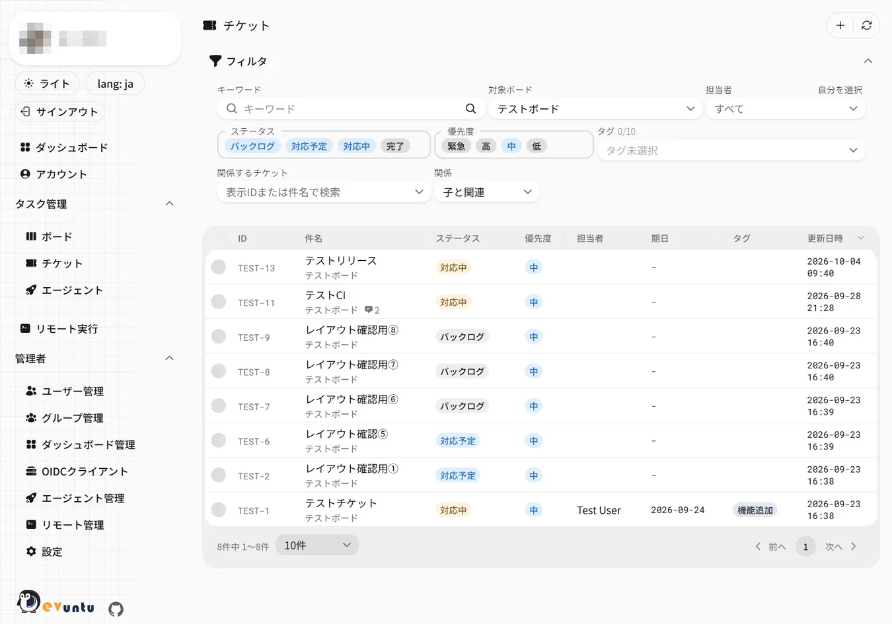

- [利用マニュアル](#利用マニュアル)
  - [サインイン](#サインイン)
  - [ダッシュボード](#ダッシュボード)
  - [ボードとかんばん](#ボードとかんばん)
    - [ボードの種類](#ボードの種類)
    - [ボードキーとチケット表示ID](#ボードキーとチケット表示id)
    - [ボード設定](#ボード設定)
  - [チケット](#チケット)
    - [チケットの項目](#チケットの項目)
    - [テンプレートから作る](#テンプレートから作る)
    - [受け入れ条件](#受け入れ条件)
    - [親子・関連チケット](#親子関連チケット)
    - [コメントとメンション](#コメントとメンション)
    - [関連リンク(ブランチ・PR・コミット)](#関連リンクブランチprコミット)
    - [変更履歴](#変更履歴)
    - [PDF出力](#pdf出力)
    - [一覧から探す](#一覧から探す)
  - [カレンダーと空き時間の共有](#カレンダーと空き時間の共有)
  - [通知](#通知)
  - [アカウント設定](#アカウント設定)
  - [リモート実行](#リモート実行)
    - [コマンドの定義を画面から編集する(オーナー)](#コマンドの定義を画面から編集するオーナー)
  - [AIとの連携](#aiとの連携)

# 利用マニュアル

> **対象**: Devuntu を使う人(チケットを書く人・見る人)
>
> - 画面ごとの使い方を、上から順に並べている。必要な節だけ読めばよい
> - 初めての人は先に [はじめに](getting-started.md) で全体の流れをつかむ
> - AI ツールやAIエージェントとの連携は [ai.md](ai.md) にまとめている

画面のURL(`/boards` など)は、ブラウザのアドレス欄に `<Devuntu の URL>/boards` のように入れると直接開ける。

## サインイン

`/auth/signin` から、次のいずれかでサインインする。どれが使えるかは管理者の設定による。

| 方法                 | 内容                                                                           |
| -------------------- | ------------------------------------------------------------------------------ |
| メールOTP            | パスワード認証が無効な環境。メールアドレスを入力し、届いた認証コードを入力する |
| パスワード           | パスワード認証が有効な環境。メールアドレスとパスワードを入力する               |
| Googleでサインイン   | Google OAuth が構成されている場合                                              |
| パスキーでサインイン | `/account` でパスキーを登録済みの場合                                          |

メールOTPとパスワードは排他で、どちらが使われるかは管理者の設定で決まる。
パスワード認証が有効な環境では、2要素認証の設定を求められることがある。
サインイン後は元のURLへ戻る。

## ダッシュボード

`/` はウィジェットを並べたダッシュボード。表示されるウィジェットは次のとおり。

- 自分の担当チケット(担当が自分で未完了のチケットを、優先度 → 期日の順に上位10件)
- 期限切れ・期限間近(担当が自分で未完了のうち、期限切れと今日から7日以内が期日のもの。期限切れは赤で表示)
- ステータス集計(自分担当のバックログ / 対応予定 / 対応中 と、直近7日に完了した件数。タイルを押すとそのステータスと担当で絞り込んだチケット一覧を開く)
- 自分宛てのメンション(チケット本文とコメントで自分がメンションされたものを新しい順に10件。自分のコメントは除く。押すとそのチケット・コメントを開く)
- 最近更新されたチケット(アクセスできるボードのチケットを更新日時の新しい順に10件。完了も含む)
- アプリ情報 / サーバー情報 / リリースノート(取得元と件数は管理者の設定による)
- お知らせ(管理者が `/admin/dashboard` で登録)
- リンク(管理者が登録した外部サイトへのショートカット)
- 転送量(管理者が Linode の転送量の取得を設定している環境のみ)
- エージェントの承認待ち(自分が承認者のエージェントが担当で、未完了かつエージェントモードが選択待ちのチケット。件数と上位10件。押すと `/agents` を開く)
- エージェントの実行状況(自分が承認者のエージェントの最近の実行10件と結果。押すと `/agents` を開く)
- 最近のリモート実行(自分が実行したリモート実行の最近10件と結果。押すと実行の詳細を開く)

エージェントの2つは[承認者](ai.md#エージェントの承認)に設定されているユーザー、最近のリモート実行は
[リモート実行](#リモート実行)のメニューが表示されるユーザーだけが選べる。条件を満たさなくなったウィジェットは表示されなくなる。

「ダッシュボードを編集」から、自分の画面の並びを左右のカラムで入れ替えられる。
初期レイアウトは管理者が設定する(未設定の場合は、左が 自分の担当チケット / 自分宛てのメンション / 期限切れ・期限間近、右が お知らせ / アプリ情報 / リリースノート)。

## ボードとかんばん

`/boards` が参加しているボードの一覧。ボードを開くとかんばんになる。
「ボード追加」でチームボードを作れる。作った人がそのボードのオーナーになる。

レーンは **バックログ / 対応予定 / 対応中 / 完了** の4つで、カードをドラッグしてステータスを変更できる。
同じレーン内での並べ替えもドラッグで行う。
完了以外の各レーンの「チケット追加」からは、このボードで、ステータスがそのレーンのチケットを作れる。
カードを選ぶと右からのサイドパネルで詳細が開き、件名のリンクからは単独のページで開く。

画面上部の絞り込みでは、担当者(未割り当てを含む)・優先度・期日・タグを指定できる。
「関係するチケット」に表示IDを指定すると、そのチケットの子・関連チケット(「関係」で子 / 関連 / 子と関連を選ぶ)だけに絞り込める。
候補はこのボードのチケットから表示ID / 件名で探せる。
完了レーンは「完了の表示期間」で指定した期間内に完了したチケットだけを表示する(最大30日。選んだ期間は全ボード共通で保持される)。

「アーカイブ済みも表示」を外している間、アーカイブしたボードは一覧に出ない。
アーカイブしてもチケットは消えない。アーカイブ中のボードは読み取り専用で、チケットの作成・編集・コメントはできない
(アーカイブの解除はボード設定から行える)。

### ボードの種類

| 種類         | 説明                                                                 |
| ------------ | -------------------------------------------------------------------- |
| チーム       | 複数人で共有するボード。メンバーやグループを割り当てる               |
| プライベート | 1ユーザーにつき1つ、自動で用意される個人用ボード。構成は変更できない |

チームボードのメンバーにはオーナーとメンバーのロールがある。
ボードの構成(メンバーなど)を変更できるのはオーナーと管理者。
タグの追加はメンバーもできる(ボード設定の「タグ管理」や、チケットのタグ欄から新しい名前を入れて作る)が、
タグの名前・色の変更と削除はオーナーと管理者だけ。

### ボードキーとチケット表示ID

ボードには大文字英数の**ボードキー**があり、チケットの表示IDは `ボードキー-連番`(例: `ABC-42`)になる。
`/t/ABC-42` でチケットを直接開けるので、チャットやメールで共有するときはこの形式が便利。

ボードキーを変更すると、共有済みの表示IDは元のチケットを指さなくなる。
過去に使われたキーの再利用もできない。

### ボード設定

かんばんの画面上部の歯車ボタンから開き、次を管理する。

- **ボード概要** — 名前、説明、ボードキー
- **ユーザーアサイン** — ユーザー単位の追加とロール(オーナー / メンバー)。プライベートボードには出ない
- **グループアサイン** — グループ単位の割り当て(管理者にだけ表示される)
- **タグ管理** — タグの追加(メンバーも可)・名前と色の変更・削除(オーナーと管理者)
- **チケットテンプレート** — チケット作成画面で選べる雛形(名前・本文・受け入れ条件・タグ・優先度)。1ボード20件まで([テンプレートから作る](#テンプレートから作る))。閲覧はメンバー全員、追加・編集・削除できるのはオーナーと管理者(プライベートボードは所有者だけ)
- **AI向けコンテキスト** — 対象リポジトリ・規約・用語など、このボードのチケットに共通する前提(Markdown。画像は挿入できない)。MCP でチケットやボードを読んだ AI ツールと、チケットを担当するエージェントへ一緒に届く([AI向けコンテキスト](ai.md#ai向けコンテキストとテンプレート))。閲覧はメンバー全員、編集できるのはオーナーと管理者
- **チャネル通知** — このボードの出来事(チケットの作成 / 完了 / 担当変更、AIエージェントの実行結果)を投稿する Slack チャンネルと、通知するイベント(設定できるのはオーナーと管理者。チームボードで、Slack 連携が有効な環境だけに出る)。
  通知先のチャンネルは、そのチャンネルで `/invite @Devuntu` を実行して Bot を招待しないと選択肢に出ない
- **GitHub連携** — 対応付ける GitHub のリポジトリと、プルリクエストのマージでチケットを完了にするか、エージェントの自動差し戻しとその上限回数(設定できるのはオーナーと管理者。[設定の手順](../admin/git-integration.md))
- **GitLab連携** — 対応付ける GitLab のプロジェクトと、マージリクエストのマージでチケットを完了にするか、エージェントの自動差し戻しとその上限回数(設定できるのはオーナーと管理者。管理者が GitLab のインスタンスを設定している場合に出る。設定が外れても、残った対応付けを外せるよう表示する。[設定の手順](../admin/git-integration.md))
- **デンジャーゾーン** — アーカイブ、ボードの削除(チケットとコメントもすべて消える)。プライベートボードには出ない

## チケット

かんばんのカードや `/tickets` の一覧の行を選ぶと、右からのサイドパネルで詳細が開く。
パネルは閉じるボタン・Escape・同じカード(行)をもう一度選ぶ・パネルの外の空いている所を押す、のいずれかで閉じる。
件名のリンクなどからは、単独のページで開く。
詳細の上部の表示IDからは、共有用のURL(`/t/ABC-42` の形)をコピーできる。
チケットの削除は、項目欄の下(作成日時の並び)の削除ボタンから行う(ボードのオーナーかチケットの作成者のみ)。

### チケットの項目

| 項目       | 内容                                     |
| ---------- | ---------------------------------------- |
| 件名       | 必須                                     |
| 説明       | Markdown。画像の挿入・貼り付けができる   |
| 担当者     | ボードのメンバーから選ぶ。未割り当ても可 |
| ステータス | バックログ / 対応予定 / 対応中 / 完了    |
| 優先度     | 緊急 / 高 / 中 / 低                      |
| 期日       | 日付。過ぎると期限切れとして表示される   |
| タグ       | ボードごとに定義したタグを複数付けられる |

チケットが属するボードは作成時に決まり、**後から変更できない**。別のボードへ移したい場合は
移動先で作り直す。

エージェントを担当者にできるボードでは、ここに「エージェントモード」も表示される
([エージェントにチケットを任せる](ai.md#エージェントにチケットを任せる))。

「受け入れ条件」は本文の直下に常に開いた状態で表示される。「親子・関連」「関連リンク」「変更履歴」は折りたたみで、
開いた直後は閉じている。見出しに件数が出るので、中身が必要なときに見出しを押して開く。

### テンプレートから作る

ボードにチケットテンプレート([ボード設定](#ボード設定))があると、チケット作成画面の右上(閉じるボタンの左)に「テンプレート」の選択が出る
(テンプレートが無いボードでは出ないので、先頭のボードを先に選ぶ)。選ぶと本文・受け入れ条件・タグ・優先度がテンプレートの内容に置き換わり、
そのまま作成前に書き換えられる。

「背景 / やること / やらないこと / 確認方法」のような見出しと受け入れ条件をテンプレートにしておくと、起票の形式がそろい、
AIエージェントがプランを立てやすくなる。MCP で接続した AI ツールからもテンプレートを指定して起票できる
([ai.md](ai.md#ai向けコンテキストとテンプレート))。

### 受け入れ条件

チケット詳細の「受け入れ条件」に、完了の基準を1項目1行で登録できる(チケットを編集できる人のみ。最大20項目)。
チケット作成画面でも、本文の下で同じように入力できる。
見出しの右にある鉛筆のボタンから、項目の追加・削除・並べ替え・文言の変更をまとめて行う。

各項目には2つの確認結果が並ぶ。

| 表示             | 意味                                                                                                                    |
| ---------------- | ----------------------------------------------------------------------------------------------------------------------- |
| チェックボックス | 人の最終確認。チケットを編集できる人がチェックし、2行目の自己申告の後ろに「✓ ◯◯ が確認」と日時が出る                    |
| ✓ / × 自己申告   | AIエージェントの自己申告(✓=充足、×=未充足。未報告なら出ない)。2行目の先頭に出て、マウスオーバーかタップで根拠を表示する |

見出しの横には「確認 x/n ・ 自己申告 y/n」の集計が出る。文言を変えた項目は、どちらの確認結果も未確認に戻る。
エージェントにチケットを任せた場合、受け入れ条件はエージェントに渡り、対応後に各項目の自己チェック結果が報告される。
MCP で接続した AI ツール(Claude Code など)からも同じ自己申告を記録できる([ai.md](ai.md))。

### 親子・関連チケット

チケット詳細の「親子・関連」で、同じボードのチケット同士に関係を持たせられる(チケットを編集できる人のみ)。
「親にする」「子にする」「関連付ける」を選び、相手を表示IDか件名で検索して候補から選んで追加する
(入力前は完了以外で最近更新されたチケットが候補に出る)。表示ID(例: `ABC-12`)や番号だけ(`12`)を直接入力して追加してもよい。
「子チケットを作成」からは、そのチケットを親とする子をその場で作れる。
作成画面のボードは親のボードで固定され、優先度とタグは親の値が初期値として入る(変更可)。作った子は順番の末尾に付く。

| 関係 | 意味                                                                                                             |
| ---- | ---------------------------------------------------------------------------------------------------------------- |
| 親子 | 大きな作業を分けたときの親と子。1つのチケットの親は1つだけで、別の親を設定すると置き換わる                       |
| 関連 | 向きの無い繋がり。どちらのチケットからも見える(例: 「v1.0.0のリリース」に含まれる対応を関連付けて探しやすくする) |

- 子→孫のような多段も作れるが、画面や集計で扱うのは**直下の1階層だけ**(親の親や孫は辿らない)
- 親と子の完了は連動しない。親の詳細とかんばんのカードには、直下の子の進み具合(完了数 / 子の数)が出る。
  未完了の子が残っていても、親を完了にするときの確認は出ない
- 子には順番(`#1` など)があり、子の一覧の上へ / 下へのボタンで並べ替えられる(押すたびに保存される)。
  同じ順番の子は並行して進められる(MCP やエージェントの起票案で付けられる)
- 子がある親には「次へ進む条件」(前の順番が完了したら / 前の順番が報告済みになったら)がある。
  エージェントに任せた子は、前の順番の兄弟がこの条件を満たすまで処理されない([タスクの分割](ai.md#タスクの分割))
- 親・子・関連のうち、1件も無いものは見出しごと表示されない。一覧の行は表示IDと件名がリンクになっている
- かんばんのカードには、子の進み具合と、子であれば親の表示IDが出る
- 子と関連の見出しの「一覧で見る」から、チケット一覧をその条件で開ける
- チケットを削除すると、そのチケットの関係も消える(子は親なしになる)

### コメントとメンション

チケットにはコメントを投稿できる。種別は3つ。

| 種別   | 用途                                   |
| ------ | -------------------------------------- |
| 通常   | 普通のコメント                         |
| プラン | 対応方針の提示。主にエージェントが使う |
| 報告書 | 対応結果の報告。主にエージェントが使う |

種別は送信ボタンのメニューで選び、「プランとして送信」「報告書として送信」のように送る。一覧は種別で絞り込める。

  
  

- コメントには1階層だけ返信できる(返信への返信はできない)
- 自分のコメントは編集できる。削除できるのは、自分のコメントか、チケットを削除できる人
- コメントの投稿・返信はチケットを編集できる人のみ

本文・コメントのどちらでも `@` に続けて名前かメールアドレスを入力すると、候補からメンションできる。
メンションされた相手には通知が飛ぶ([通知](#通知))。

### 関連リンク(ブランチ・PR・コミット)

チケット詳細の「関連リンク」に、GitHub / GitLab のブランチ / プルリクエスト(マージリクエスト) / コミットの URL を貼って紐付けられる
(チケットを編集できる人のみ)。AIエージェントや MCP クライアントからも同じように紐付けられる。
GitLab は管理者が設定したインスタンスの URL だけを受け付ける。

ボード設定の「GitHub連携」/「GitLab連携」でリポジトリを対応付けると、次が自動で反映される
(対応付けと Webhook の登録はボードのオーナーか管理者が行う。手順は [git-integration.md](../admin/git-integration.md))。

- プルリクエスト(マージリクエスト)のタイトルと状態(オープン / ドラフト / マージ済み / クローズ)
- CI の結果(実行中 / 成功 / 失敗 / キャンセル)
- ブランチ名の先頭にそのボードの表示IDがあるプルリクエストの自動紐付け(例: `feature/ABC-12`、`ABC-12-fix`)。
  `feature/add-ABC-12` のように途中にあるものは拾わない。自動で付いたリンクを外すと、付け直されることは無い

ボードの設定によっては、プルリクエストのマージでチケットが自動で完了になったり、CI の失敗やレビュー指摘で
エージェントへ自動で差し戻されたりする([連携のオプション](../admin/git-integration.md#連携のオプション))。
自動差し戻しの回数は、チケット詳細の処理状態の横に出る。

### 変更履歴

チケット詳細の「変更履歴」に、いつ・誰が・何を変えたかが新しい順で表示される(直近100件)。
画面・MCP・AIエージェントのどこから変えても、同じように記録される。

| 記録する項目 | 表示する内容                                                    |
| ------------ | --------------------------------------------------------------- |
| 作成         | 作成した人と日時                                                |
| ステータス   | 変更前 → 変更後(マージによる自動完了は「マージによる自動完了」) |
| 担当者・タグ | 変更前 → 変更後の名前                                           |
| 優先度・期日 | 変更前 → 変更後                                                 |
| 件名・内容   | 変更前 → 変更後(内容は先頭100文字の抜粋)                        |
| 受け入れ条件 | 消した項目(取り消し線)と足した項目。文言の修正は両方に出る      |

- 同じ値を保存し直しただけの項目や、受け入れ条件の並べ替えだけの変更は記録しない
- 受け入れ条件のチェック・エージェントの自己申告、コメントの投稿は記録しない(それぞれの欄で確認できる)
- 変更した人が退会すると「名前なし」と表示される
- 保持期間(既定365日)を過ぎた履歴は自動で消える([operations.md](../admin/operations.md#自動メンテナンス))

### PDF出力

チケット全体、またはプラン/報告書の 1 件を PDF にできる。

| 出力するもの    | ボタンの場所                                     | 含まれる内容                                                                                            |
| --------------- | ------------------------------------------------ | ------------------------------------------------------------------------------------------------------- |
| チケット全体    | 項目欄の下(作成日時の並び)の「PDF出力」          | 項目・タグ・内容・受け入れ条件・親子/関連・関連リンク・すべてのコメント(返信を含む)。変更履歴は含まない |
| プラン / 報告書 | そのプラン / 報告書のコメントの右上の「PDF出力」 | そのコメントの本文(件名・表示ID・投稿者・日時を添える)。通常のコメントにはボタンが出ない                |

ボタンを押すと印刷用のページが別タブで開き、本文と画像を読み込み終えたところで印刷ダイアログが開く。
送信先(プリンター)で「PDFに保存」を選んで保存する。ファイル名の初期値は `表示ID 件名`(プラン / 報告書は `表示ID プラン` など)。
ダイアログを閉じた後は、ページ上部の「印刷 / PDFに保存」から開き直せる。
画面をダークテーマにしていても、印刷用のページは白地で出る。

### 一覧から探す

`/tickets` はアクセスできるすべてのボードのチケットを横断して表示する。
キーワード、ボード、ステータス、優先度、担当者、タグで絞り込める(タグは対象のボードを選んでから指定する)。
件名・ステータス・優先度・担当者・期日・更新日時の列で並べ替えられ、既定は更新日時の新しい順(表示IDとタグでは並べ替えられない)。
「関係するチケット」でチケットを選ぶと、そのチケットの直下の子 / 関連チケット / その両方に絞り込める。
入力欄に触れると最近更新されたチケットが候補に出て、表示IDや件名で探せる(対象ボードを選んでいればそのボードの中から)。
表示IDを直接入れて Enter でも絞り込める。
検索結果には表示件数の上限がある。

## カレンダーと空き時間の共有

`/cal` は、Google カレンダーの空き時間を外部の人と共有するための設定画面(共有タイトル・共有URL・再発行・無効化と、予定の追加登録)。
予定そのものはこの画面には出ず、共有URLの公開ページで週ごとに表示される。
**Googleアカウント連携が前提**で、未連携の場合は連携を促す案内が出る。
管理者が Google 連携を有効にしていない環境や、許可グループに入っていないユーザーは使えない(サイドメニューにも出ない)。

「空き時間の共有」を有効にすると、共有URL(`/cal/[id]`)が発行される。共有URLでは、週単位で前後の週へ移動して空き状況を見られる。

- **共有URLは認証不要の公開ページ**。URLを知っていれば誰でも空き状況を見られる
- 見えるのは「予定あり」の時間帯だけで、予定の件名や詳細は公開されない
- 共有タイトルを設定できる
- URLを再発行すると以前のURLは無効になる。共有をやめるときは無効化する

共有を有効にすると「予定の追加登録」が使えるようになり、毎週固定の予定(曜日と時間帯)を登録できる。
定例会議など、Google カレンダーに入れていない時間を空き時間から除きたいときに使う
(共有を有効にする前は表示されない)。

## 通知

次のイベントを **メール** / **Slack DM** / **Web プッシュ**で受け取れる。

- **メンション** — チケット本文やコメントで `@` メンションされたとき
- **担当者の変更** — チケットの担当者に指定されたとき
- **AIエージェントの実行結果** — 自分が作成したチケットの処理が終わったとき(プランへの返信や報告の確認が必要かも分かる)

メールは5分ごとに区切り、その間の通知をまとめて1通で送る(最大5分遅れて届く)。
`/account` の「通知設定」で、イベント種別 × チャネルごとに ON/OFF を切り替えられる。
Slack 通知を受け取るには、管理者による Slack 連携の有効化と、自分の Slack アカウント連携の両方が必要
(Slack 側のメールアドレスが Devuntu のものと一致している必要がある。管理者が許可グループを指定している場合は、そのグループのユーザーだけが使える)。
Web プッシュは端末ごとの登録が必要なので、通知を受け取りたい端末で「通知設定」内の「Webプッシュ通知」から登録する
(iPhone / iPad は iOS / iPadOS 16.4 以降で、ホーム画面に追加したアプリから開いた場合のみ受け取れる。Safari のタブからは登録できない)。

チームボードでは、チケットの作成・完了・担当者の変更・エージェントの実行結果を Slack チャンネルへ
流せる(設定はボードのオーナーか管理者がボード設定の「チャネル通知」で行う。通知先のチャンネルには Bot の招待が必要)。

Slack に貼ったチケットURLは、閲覧権限を確認したうえでカード表示に展開される
(プライベートボードのチケットは展開しない)。
管理者向けの設定は [notifications.md](../admin/notifications.md) を参照。

## アカウント設定

`/account` で次を設定する。

- **アバター** — サインイン時に連携元の画像がコピーされる。独自の画像を設定すると以降はコピーされない
- **タイムゾーン** — 日時の表示に使われる
- **パスキー** — パスキーの登録・削除。パスキーでのサインインに使う
- **Googleアカウント** — 連携・解除(カレンダー機能の前提)。管理者が Google 連携を有効にし、許可グループで自分が対象になっている場合のみ表示
- **Slack** — 連携・解除(Slack 通知の前提)。管理者が Slack 連携を有効にし、許可グループで自分が対象になっている場合のみ表示
- **許可済みアプリ** — MCPクライアントなどに与えたアクセスの確認と取り消し
- **MCPトークン** — AI ツールから MCP へ接続するための長期トークンの発行・削除(最大10本)。
  発行時に有効期限(30 / 90 / 180 / 365日、または無期限)を選ぶ。発行後に、トークンと Claude Code / Codex CLI の登録コマンドが表示される
  (トークンはこのときだけ表示される。[ai.md](ai.md#aiツールからつなぐmcp))
- **通知設定** — 通知のイベント種別 × チャネル別 ON/OFF と、「Webプッシュ通知」での端末の登録・解除
  (Webプッシュの端末を1台も登録していない間や、Slack 連携が使えない環境では、そのチャネルのチェックボックスが無効になり、マウスオーバーで理由が出る)

テーマ(ライト / ダーク)と表示言語は、サイドメニューの上部で切り替えられる。

## リモート実行

管理者が用意した処理を `/commands` から実行できる。デプロイやバッチの再実行など、
これまで担当者に依頼していた作業を自分で回すための画面。
**メニューに出るのは、自分がターゲットにアサインされている場合だけ**。

コマンドはターゲット(接続先のサーバー)ごとに折りたためるセクションにまとまっている
(最初はすべて開いた状態)。実行できるのは、そのターゲットにアサインされている人だけ。
アサインは管理者が行う([権限](../admin/command-exec.md#権限))。
ターゲットにはメンバーとオーナーのロールがあり、オーナーは実行に加えてコマンドの定義を画面から編集できる。

1. `/commands` で実行したいコマンドの「実行」を押す
2. 入力欄を埋める。ほとんどは選択肢から選ぶ形で、選べる値は管理者が定義したものだけ。
   文字を直接書く欄が出ることもあるが、そこにも**使える文字と長さの制限がある**
   (使えない文字を入れるとその場で赤くなる)
3. 実行する(実行前の確認が設定されたコマンドでは、確認ダイアログで内容を確かめてから実行する)
4. 実行の詳細画面へ移り、出力が流れてくる

出力は実行中もそのまま流れる。画面を閉じても実行は続き、`/commands/runs` の履歴から開き直せば
途中からでも最後まで見られる。実行中の画面では「中断」で止められる。

カードの右下にある時計のボタンを押すと、**そのコマンドだけに絞り込んだ履歴**が開く。
絞り込みは履歴画面の上に出る名前の「×」で解除できる。

取り返しのつかないコマンドでは、ログインからしばらく経っていると再認証を求められることがある。

| 状態     | 意味                                      |
| -------- | ----------------------------------------- |
| 順番待ち | 受け付けたが、まだ動き出していない        |
| 実行中   | 動いている                                |
| 成功     | 終了コード 0 で終わった                   |
| 失敗     | 非0で終わった、または接続や時間切れで中断 |
| 中断     | 画面から止めた                            |

「このコマンドは既に実行中です」と出る場合は、同じコマンドを同時に動かせない設定になっている。終わるのを待ってから実行し直す。
履歴に出るのは自分の実行だけで、他の人の実行は見えない(管理者は履歴の「全員の実行」で全員分を見られる)。

### コマンドの定義を画面から編集する(オーナー)

定義ファイルに `editable` が設定されているターゲットでは、オーナーがコマンドの追加・編集・削除を
`/commands` の歯車ボタン(ターゲット設定)から行える。編集はコマンド 1 件ぶんの YAML を書く形で、
保存時に検証される。**接続先(ホスト・ユーザー・鍵)は画面からは変えられない。**

検証は**書いている最中にも走る**。打鍵が止まると YAML の構文と内容の両方を見て、
問題のある行に印が付く(印にカーソルを合わせるか、行頭の印をタップすると理由が出る)。
まだ書かれていない必須項目は警告、書いた内容が間違っているものはエラーとして区別する。
保存はエラーが残っていても試せる。ファイルをまたぐID重複や編集権限のように、サーバーでしか分からない問題は保存時に返る。

- ログインから時間が経っていると、追加・編集ボタンを押した時点で再認証を求められる。認証後に元の画面へ戻ってから書き始める
- 画面から保存すると、コマンドの定義の中に書かれていたコメントは消える。残したい説明は `description` へ書く
- 編集の導線が出ない場合は、自分がオーナーでないか、そのターゲットが編集を許可されていないか、
  定義ディレクトリが書き込みできない状態になっている(管理者向けの設定は
  [command-exec.md](../admin/command-exec.md#画面から編集する)を参照)
- 保存時に「他の人が編集しました」と出た場合は、読み込んだ後に別の経路でファイルが
  変わっている。再読み込みしてからやり直す

## AIとの連携

自分の AI ツール(Claude Code / Codex CLI など)からチケットを読み書きしたり、
AIエージェントを担当者にしてチケットを任せたりできる。使い方は [ai.md](ai.md) にまとめている。

- [AIツールからつなぐ(MCP)](ai.md#aiツールからつなぐmcp)
- [エージェントにチケットを任せる](ai.md#エージェントにチケットを任せる)
- [エージェントの承認](ai.md#エージェントの承認)

管理者だけが使う画面(`/admin/**`)は [運用者向けドキュメント](../admin/README.md#管理者の画面) を参照。
